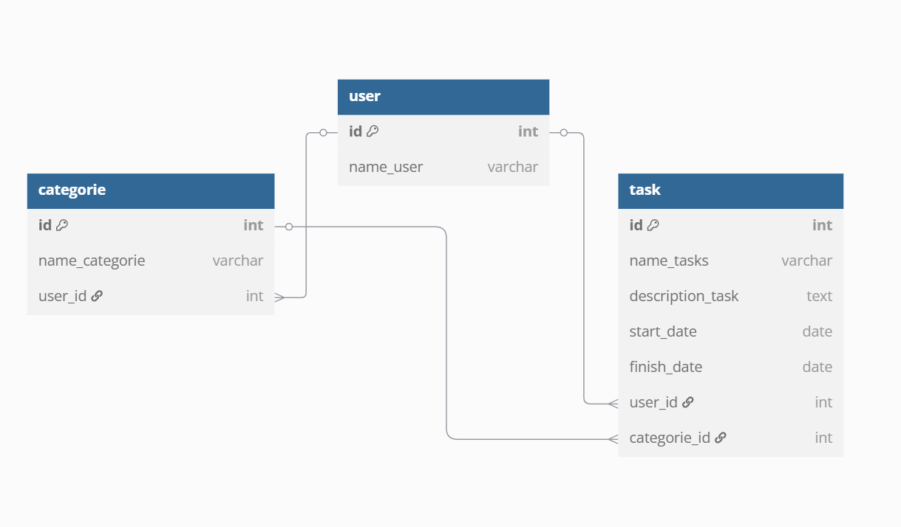
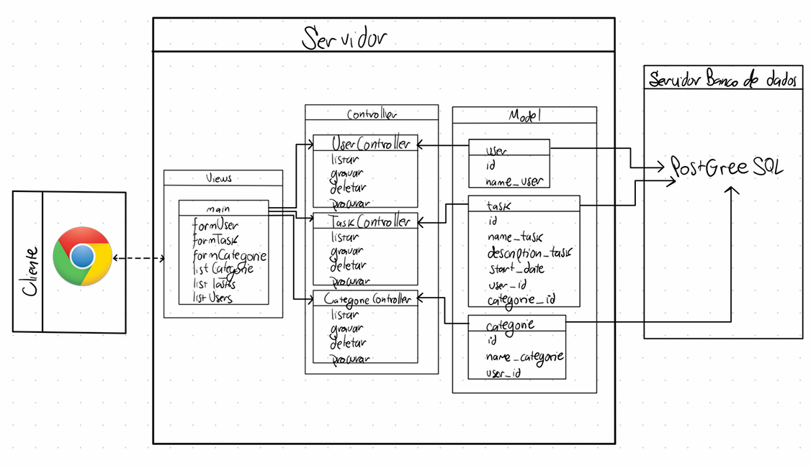

# Web Application Document - Projeto Individual - Módulo 2 - Inteli

**_Os trechos em itálico servem apenas como guia para o preenchimento da seção. Por esse motivo, não devem fazer parte da documentação final._**

## Taskador

#### Yan Dimitri Kruziski

## Sumário

1. [Introdução](#c1)  
2. [Visão Geral da Aplicação Web](#c2)  
3. [Projeto Técnico da Aplicação Web](#c3)  
4. [Desenvolvimento da Aplicação Web](#c4)  
5. [Referências](#c5)  

<br>

## <a name="c1"></a>1. Introdução (Semana 01)

Esta aplicação é um gerenciador de tarefas que foi desenvolvido para otimizar a organização pessoal e a produtividade pessoal. Com uma interface inspirada em designs modernos, ela permite criar, editar, marcar atividades como concluidas, além de definir filtragem por classificação e acompanhar as atividades dos próximos dias de forma intuitiva. Integrada ao Supabase, oferece armazenamento seguro e sincronização em tempo real. Sendo assim um site ideal para quem busca clareza no planejamento diário e eficiência na execução de projetos.

---

## <a name="c2"></a>2. Visão Geral da Aplicação Web

### 2.1. Personas (Semana 01)

*Posicione aqui sua(s) Persona(s) em forma de texto markdown com imagens, ou como imagem de template preenchido. Atualize esta seção ao longo do módulo se necessário.*

### 2.2. User Stories (Semana 01)

*Posicione aqui a lista de User Stories levantadas para o projeto. Siga o template de User Stories e utilize a referência USXX para numeração (US01, US02, US03, ...). Indique todas as User Stories mapeadas, mesmo aquelas que não forem implementadas ao longo do projeto. Não se esqueça de explicar o INVEST de 1 User Storie prioritária.*

---

## <a name="c3"></a>3. Projeto da Aplicação Web

### 3.1. Modelagem do banco de dados  (Semana 3)

A modelagem de banco de dados é um processo que estrutura e organiza os dados de forma lógica e eficiente, visando atender às necessidades de uma determinada aplicação ou sistema. Que envolve a definição de entidades, atributos e relacionamentos, garantindo a integridade e a consistência das informações armazenadas. Esse processo é fundamental para o desenvolvimento de sistemas robustos e escaláveis, o que facilita a manutenção e a evolução do banco de dados ao longo do tempo.

#### Modelo físico

O modelo físico de dados é a etapa da modelagem que traduz o modelo lógico em uma estrutura concreta e detalhada, pronta para ser implementada em um sistema de banco de dados específico. Nessa fase, definem-se tabelas, colunas, tipos de dados, índices, restrições e relacionamentos, considerando as particularidades do SGBD escolhido. É essencial para garantir que o banco de dados atenda aos requisitos de desempenho, integridade e escalabilidade da aplicação.

```sql
CREATE TABLE IF NOT EXISTS users (
  id SERIAL PRIMARY KEY,
  name_user VARCHAR NOT NULL
);

CREATE TABLE IF NOT EXISTS categorie (
  id SERIAL PRIMARY KEY,
  name_categorie VARCHAR NOT NULL,
  user_id INTEGER REFERENCES users(id) ON DELETE CASCADE
);

CREATE TABLE IF NOT EXISTS task (
  id SERIAL PRIMARY KEY,
  name_tasks VARCHAR NOT NULL,
  description_task TEXT,
  start_date DATE,
  finish_date DATE,
  user_id INTEGER REFERENCES users(id) ON DELETE CASCADE,
  categorie_id INTEGER REFERENCES categorie(id) ON DELETE SET NULL
);
```


#### Lógica Relacional

Nesse modelo, os dados são organizados em tabelas (ou relações), onde cada uma das linha vai representar um registro e cada coluna, um atributo. As tabelas se interconectam por meio de chaves primárias e estrangeiras, que permitem relacionamentos consistentes entre os dados. Baseada na teoria dos conjuntos e na lógica de predicados, essa abordagem facilita a integridade, a consistência e a flexibilidade na manipulação das informações

<div align="center">
<sub>Figura x - Lógica Relacional</sub>

<sup>Fonte: Material produzido pelo autor (2025)</sup>
</div>
<br>


### 3.2. Arquitetura (Semana 5)

A estrutura segue um padrão MVC, que está organizado de forma clara e modular. O cliente acessa o sistema via navegador, assim interagindo com as Views, sendo responsáveis por exibir formulários e listas para usuários, tarefas e categorias. As Views então se comunicam com os Controllers (UserController, TaskController e CategorieController), que gerenciam as ações de listar, gravar, deletar e procurar dados. Os Controllers manipulam os Models (user, task e categorie), que representam diretamente as tabelas do banco de dados com seus respectivos atributos. Os Models interagem com o servidor de banco de dados, garantindo a persistência das informações. Essa separação de responsabilidades facilita a manutenção, escalabilidade e organização do sistema.

<div align="center">
<sub>Figura x - Arquitetura MVC</sub>

<sup>Fonte: Material produzido pelo autor (2025)</sup>
</div>
<br>
  
### 3.3. Wireframes (Semana 03)

*Posicione aqui as imagens do wireframe construído para sua solução e, opcionalmente, o link para acesso (mantenha o link sempre público para visualização).*

### 3.4. Guia de estilos (Semana 05)

*Descreva aqui orientações gerais para o leitor sobre como utilizar os componentes do guia de estilos de sua solução.*


### 3.5. Protótipo de alta fidelidade (Semana 05)

*Posicione aqui algumas imagens demonstrativas de seu protótipo de alta fidelidade e o link para acesso ao protótipo completo (mantenha o link sempre público para visualização).*

### 3.6. WebAPI e endpoints (Semana 05)

*Utilize um link para outra página de documentação contendo a descrição completa de cada endpoint. Ou descreva aqui cada endpoint criado para seu sistema.*  

### 3.7 Interface e Navegação (Semana 07)

*Descreva e ilustre aqui o desenvolvimento do frontend do sistema web, explicando brevemente o que foi entregue em termos de código e sistema. Utilize prints de tela para ilustrar.*

---

## <a name="c4"></a>4. Desenvolvimento da Aplicação Web (Semana 8)

### 4.1 Demonstração do Sistema Web (Semana 8)

*VIDEO: Insira o link do vídeo demonstrativo nesta seção*
*Descreva e ilustre aqui o desenvolvimento do sistema web completo, explicando brevemente o que foi entregue em termos de código e sistema. Utilize prints de tela para ilustrar.*

### 4.2 Conclusões e Trabalhos Futuros (Semana 8)

*Indique pontos fortes e pontos a melhorar de maneira geral.*
*Relacione também quaisquer outras ideias que você tenha para melhorias futuras.*


## <a name="c5"></a>5. Referências

_Incluir as principais referências de seu projeto, para que seu parceiro possa consultar caso ele se interessar em aprofundar. Um exemplo de referência de livro e de site:_<br>

---
---